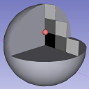
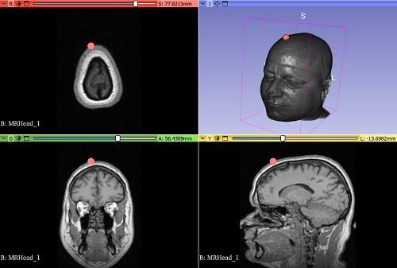

SlicerVirtualMouseCursor
========================

Extension for 3D slicer that enables user to interact with the 2D and 3D scenes using a virtual mouse cursor.

This extension replaces the appliction mouse pointer with a fiducial node that is directly rendered in the scene.
The virtual cursor node is projected onto the surface or volume being hovered, or in the camera focal plane if no intersection is found.

## How to use

This extension provides a single module in the "Utilities" category.
When selecting the VirtualCursor module, the application mouse pointer is automatically replaced by a fiducial node when hovering the render views.
The virtual cursor can be disabled at any time by unchecking the corresponding checkbox in the module's widget.
A slider is available as well in order to control the size of the cursor.

## License

This software is licensed under the terms of the [Apache Licence Version 2.0](LICENSE).

The license file was added at revision [e184c198](https://github.com/KitwareMedical/SlicerVirtualMouseCursor/commit/e184c198) on 2023-07-04, but you may consider that the license applies to all prior revisions as well.
